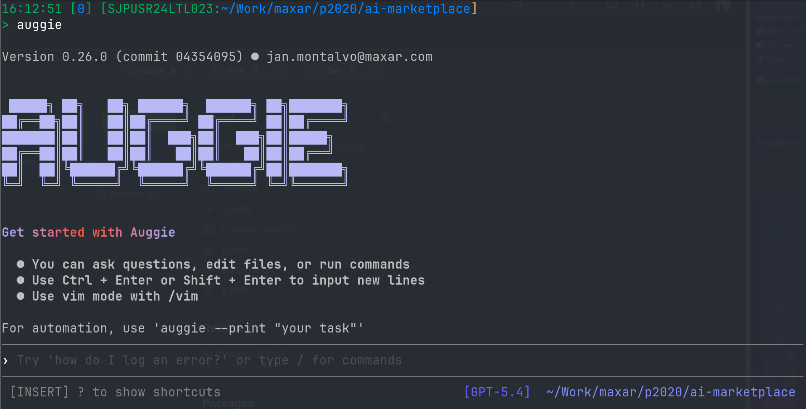
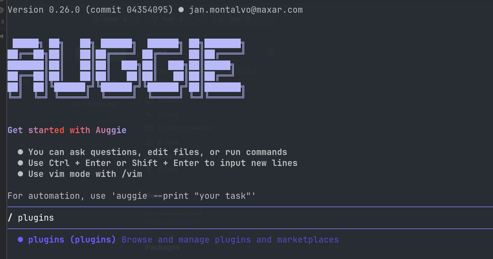
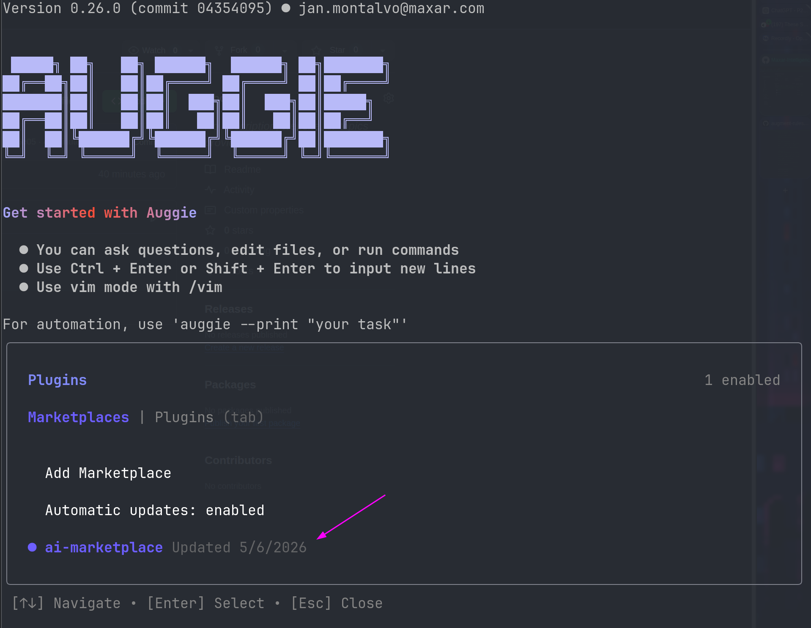
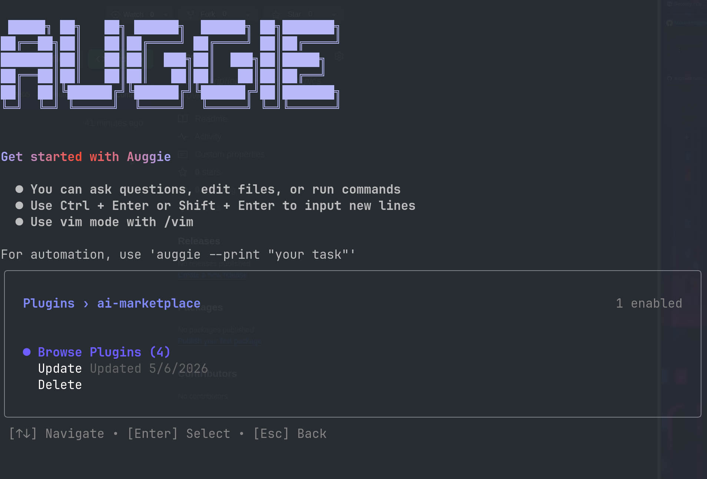
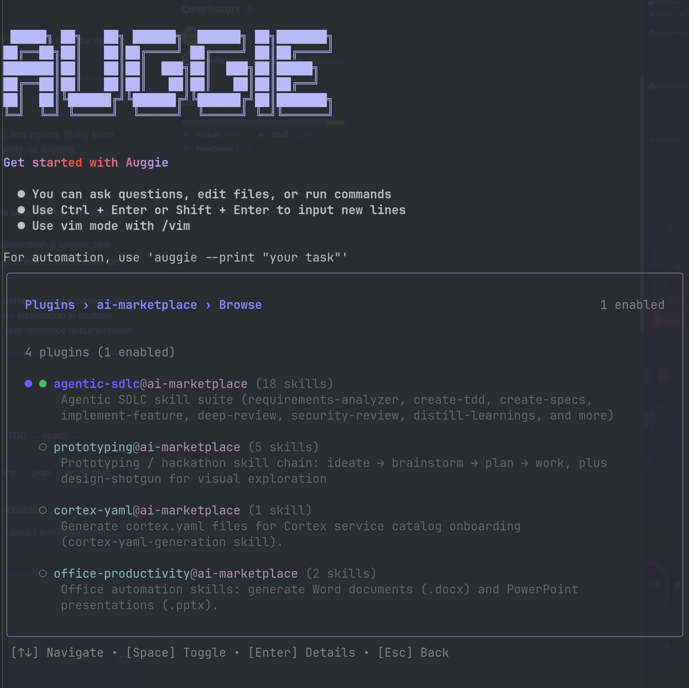
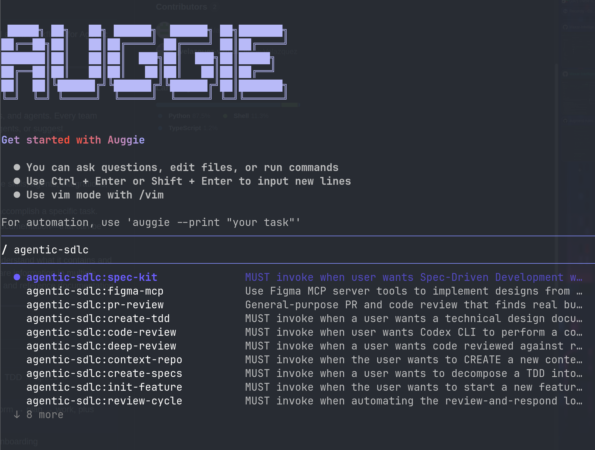
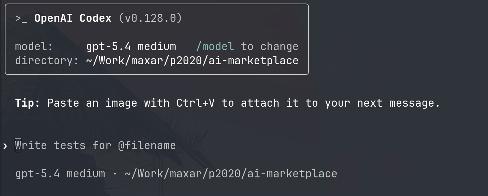
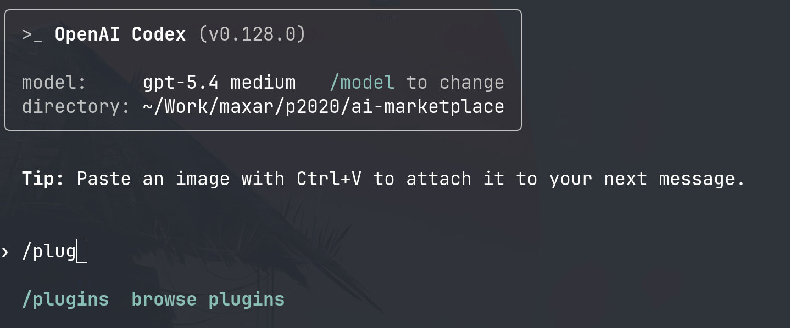
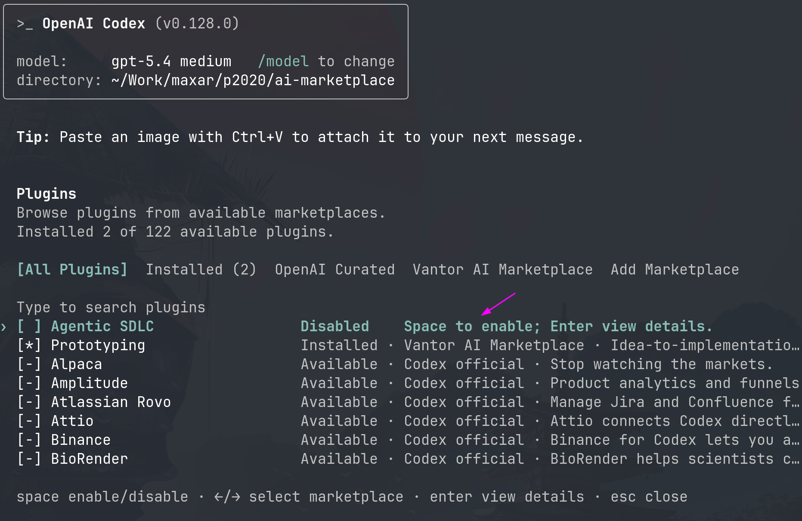
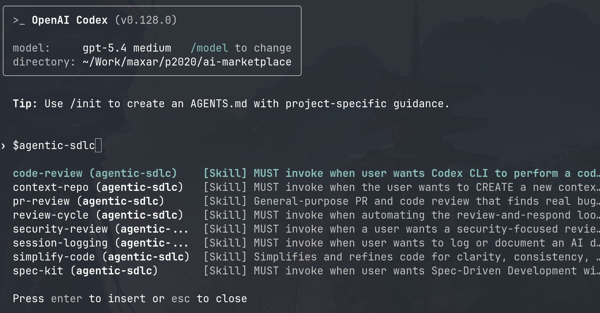

# Agentic Marketplace

Agentic plugins and skills for Codex and Auggie.

## Table of Contents

- [Installation](#installation)
  - [Auggie](#auggie)
  - [Codex](#codex)
- [Skill Map](#skill-map)
- [Plugin Catalog](#plugin-catalog)
- [Repository Layout](#repository-layout)
- [Contributing](#contributing)

## Installation

### Auggie

> [!NOTE]
> Augment plugins installed from the CLI are available to Augment in VS Code and
> JetBrains integrations that use the same user environment. You do not need a
> separate IDE marketplace setup after the CLI setup is complete.

1. Add the marketplace first:

```bash
auggie plugin marketplace add https://github.com/JanMichaelSE/agentic-marketplace
```

2. Then install and enable the plugins you want. This terminal flow is an
   alternative to the UI flow below; you do not need both:

```bash
auggie plugin install ai-workflow@agentic-marketplace
auggie plugin install atlassian@agentic-marketplace
auggie plugin install development@agentic-marketplace
auggie plugin install experimental@agentic-marketplace
auggie plugin install github@agentic-marketplace
auggie plugin install infrastructure@agentic-marketplace
auggie plugin install keychain@agentic-marketplace
auggie plugin install review-toolkit@agentic-marketplace
auggie plugin install software-architecture@agentic-marketplace
```

Or, after adding the marketplace, enable plugins in the Auggie terminal UI:

1. Open Auggie in any folder:



2. Use `/plugins` command:



3. Select the marketplace installed:



4. Select `Browse Plugins`:



5. A list of plugins will appear. Press `Space` on the plugins you want to enable:



6. Close and reopen Auggie. The enabled skills should appear with the marketplace as the prefix:



### Codex

> [!NOTE]
> Codex plugins installed from the CLI are available to Codex in VS Code and
> JetBrains integrations that use the same user environment. You do not need a
> separate IDE marketplace setup after the CLI setup is complete.

1. Add the marketplace first:

```bash
codex plugin marketplace add https://github.com/JanMichaelSE/agentic-marketplace
```

2. Then install the plugins you want:

```bash
codex plugin add ai-workflow@agentic-marketplace
codex plugin add atlassian@agentic-marketplace
codex plugin add development@agentic-marketplace
codex plugin add experimental@agentic-marketplace
codex plugin add github@agentic-marketplace
codex plugin add infrastructure@agentic-marketplace
codex plugin add keychain@agentic-marketplace
codex plugin add review-toolkit@agentic-marketplace
codex plugin add software-architecture@agentic-marketplace
```

Or, after adding the marketplace, enable plugins in the Codex terminal UI.

1. Open Codex in any folder:



2. Use `/plugins` command:



3. Select the plugin you want and enable it with `Space`:



4. Use `$` to reference skills from an enabled plugin:



## Skill Map

Detailed purpose and usage notes live in the plugin README and each `SKILL.md`. For execution planning and implementation slicing, use [create-execution-plan](plugins/ai-workflow/skills/create-execution-plan/SKILL.md) and [create-implementation-slices](plugins/ai-workflow/skills/create-implementation-slices/SKILL.md).

| Plugin | Skills and agents |
|------|-------------------|
| [ai-workflow](plugins/ai-workflow/README.md) | [grill-me](plugins/ai-workflow/skills/grill-me/SKILL.md), [grill-with-docs](plugins/ai-workflow/skills/grill-with-docs/SKILL.md), [create-execution-plan](plugins/ai-workflow/skills/create-execution-plan/SKILL.md), [create-implementation-slices](plugins/ai-workflow/skills/create-implementation-slices/SKILL.md), [run-workflow](plugins/ai-workflow/skills/run-workflow/SKILL.md), [jira-plan-import](plugins/ai-workflow/skills/jira-plan-import/SKILL.md), [jira-plan-sync](plugins/ai-workflow/skills/jira-plan-sync/SKILL.md), [jira-checkpoint-sync](plugins/ai-workflow/skills/jira-checkpoint-sync/SKILL.md), [implement-scope](plugins/ai-workflow/skills/implement-scope/SKILL.md), [refactor](plugins/ai-workflow/skills/refactor/SKILL.md), [review](plugins/ai-workflow/skills/review/SKILL.md), [repair-findings](plugins/ai-workflow/skills/repair-findings/SKILL.md), [summarize-changes](plugins/ai-workflow/skills/summarize-changes/SKILL.md), [publish-draft-pr](plugins/ai-workflow/skills/publish-draft-pr/SKILL.md) |
| [atlassian](plugins/atlassian/README.md) | [acli-jira](plugins/atlassian/skills/acli-jira/SKILL.md), [confluence-research](plugins/atlassian/skills/confluence-research/SKILL.md) |
| [development](plugins/development/README.md) | [inception-planning](plugins/development/skills/inception-planning/SKILL.md), [grilling](plugins/development/skills/grilling/SKILL.md), [research](plugins/development/skills/research/SKILL.md), [construction-implementation](plugins/development/skills/construction-implementation/SKILL.md), [tdd](plugins/development/skills/tdd/SKILL.md), [prototype](plugins/development/skills/prototype/SKILL.md), [diagnosing-bugs](plugins/development/skills/diagnosing-bugs/SKILL.md), [resolving-merge-conflicts](plugins/development/skills/resolving-merge-conflicts/SKILL.md), [simplify-code](plugins/development/skills/simplify-code/SKILL.md), [figma-mcp](plugins/development/skills/figma-mcp/SKILL.md), [webapp-testing](plugins/development/skills/webapp-testing/SKILL.md), [handoff](plugins/development/skills/handoff/SKILL.md), [create-pr-overview](plugins/development/skills/create-pr-overview/SKILL.md) |
| [experimental](plugins/experimental/README.md) | [code-review](plugins/experimental/skills/code-review/SKILL.md), [improve-repo-harness](plugins/experimental/skills/improve-repo-harness/SKILL.md), [writing-great-skills](plugins/experimental/skills/writing-great-skills/SKILL.md), [zoom-out](plugins/experimental/skills/zoom-out/SKILL.md) |
| [github](plugins/github/README.md) | [github](plugins/github/skills/github/SKILL.md), [github-actions](plugins/github/skills/github-actions/SKILL.md) |
| [infrastructure](plugins/infrastructure/README.md) | [aws-patterns](plugins/infrastructure/skills/aws-patterns/SKILL.md), [kubernetes-patterns](plugins/infrastructure/skills/kubernetes-patterns/SKILL.md), [force-pod-restart-on-deploy](plugins/infrastructure/skills/force-pod-restart-on-deploy/SKILL.md) |
| [keychain](plugins/keychain/README.md) | [macos-keychain-secrets](plugins/keychain/skills/macos-keychain-secrets/SKILL.md) |
| [review-toolkit](plugins/review-toolkit/README.md) | [design-principles-review](plugins/review-toolkit/skills/design-principles-review/SKILL.md), [draft-code-review-comment](plugins/review-toolkit/skills/draft-code-review-comment/SKILL.md), [multi-agent-code-review](plugins/review-toolkit/skills/multi-agent-code-review/SKILL.md), [orchestrated-review](plugins/review-toolkit/skills/orchestrated-review/SKILL.md), [pr-comment-addressed-check](plugins/review-toolkit/skills/pr-comment-addressed-check/SKILL.md), [requirements-to-tests-traceability](plugins/review-toolkit/skills/requirements-to-tests-traceability/SKILL.md), [security-review](plugins/review-toolkit/skills/security-review/SKILL.md), [test-correctness-review](plugins/review-toolkit/skills/test-correctness-review/SKILL.md), [test-coverage-review](plugins/review-toolkit/skills/test-coverage-review/SKILL.md) |
| [software-architecture](plugins/software-architecture/README.md) | [codebase-design](plugins/software-architecture/skills/codebase-design/SKILL.md), [domain-modeling](plugins/software-architecture/skills/domain-modeling/SKILL.md), [improve-codebase-architecture](plugins/software-architecture/skills/improve-codebase-architecture/SKILL.md) |

## Plugin Catalog

| Plugin | Count | Purpose |
|------|------:|---------|
| [ai-workflow](plugins/ai-workflow/README.md) | 14 skills | Plan grilling, domain-aware decision capture, planning, slicing, orchestration, implementation, refactoring, review, repair, Jira-native sync, publishing, and change-summary handoff workflow. |
| [atlassian](plugins/atlassian/README.md) | 2 skills | Vendor-neutral Jira lifecycle guidance and read-oriented Confluence research. |
| [development](plugins/development/README.md) | 13 skills | Planning, implementation, discovery, diagnostics, prototyping, Figma-backed UI, local web testing, simplification, research, merge-resolution, and handoff workflows. |
| [experimental](plugins/experimental/README.md) | 4 skills | Focused preview skills retained while they gather feedback. |
| [github](plugins/github/README.md) | 2 skills | GitHub CLI repository operations and repository-first GitHub Actions guidance. |
| [infrastructure](plugins/infrastructure/README.md) | 3 skills | AWS, Kubernetes, Terraform, cloud infrastructure, and Helm rollout patterns. |
| [keychain](plugins/keychain/README.md) | 1 skill | Cross-platform developer-laptop credential storage guidance. |
| [review-toolkit](plugins/review-toolkit/README.md) | 9 skills | Design, code, security, review-comment lifecycle, requirements, test correctness, test coverage, and orchestrated reviews. |
| [software-architecture](plugins/software-architecture/README.md) | 3 skills | Deep-module design, domain modeling, ADR, and architecture-improvement guidance. |

## Repository Layout

```text
agentic-marketplace/
├── .agents/plugins/marketplace.json   # Codex marketplace manifest
├── .augment-plugin/marketplace.json   # Auggie marketplace manifest
├── plugins/
│   ├── ai-workflow/
│   ├── atlassian/
│   ├── development/
│   ├── experimental/
│   ├── github/
│   ├── infrastructure/
│   ├── keychain/
│   ├── review-toolkit/
│   ├── software-architecture/
│   └── README.md                      # Plugin scaffold guidance
├── AGENTS.md                          # Maintenance instructions for agents
└── README.md
```

Most plugins use this structure:

```text
plugins/<plugin-name>/
├── .codex-plugin/plugin.json
├── .augment-plugin/plugin.json
├── README.md
└── skills/
```

All current plugins support both Auggie and Codex and use the shared `skills/` layout.

## Contributing

1. Propose a new skill, plugin, agent, or enhancement in an issue or discussion when useful.
2. Create a branch from `main` and keep the change scoped.
3. Test the behavior or provide validation evidence for docs-only changes.
4. Update the root `README.md`, the relevant plugin `README.md`, and marketplace manifests when plugin, skill, or agent contents change.
5. Open a pull request against `main` and confirm you reviewed the security section.
